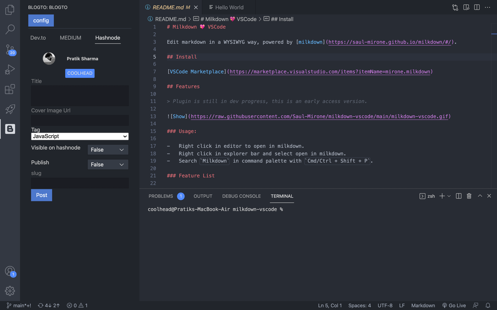

## BlogTo is a simple vscode extension which helps your post your ideas from vscode. 

Write your blogs in a markdown file. Open blogto from sidebar view. You will be able to post your markdown content from the vscode to hashnode, medium or dev.to. 

Reasons to use the extension 

- Its in your favourite texteditor
- avoids openning multiple tabs :(
- post to hashnode, medium or dev.to

## Features

Features (0.5.0): 

1. Post blogs to dev.to, medium and hashnode
2. Simple UI
3. Good feedback.
4. Simple to set up

## Requirements

### Setup up : 

1. Download the extension here 
2. Open blogto from the sidebar view.
3. Click on the config button, set up the api tokens for medium,dev. to and hashnode.
    1. This will fetch your data and save it to localSession in vscode
    2. To reset you can submit the details again.
4. Start posting blogs
5. Issues and Error, contact : pratik@coolhead.in, github here

## Extension Settings

## Known Issues

Upcoming Features,Bugs, issues and possible solutions. 

1. Image uploading  
    - Extract all the image tags, uploading them on the platform via api, get the image url and replace them in the markdown.
2. There is a limit of 10 requests per 30 seconds.(dev.to)
3. Posting as organisation

## Release Notes

Users appreciate release notes as you update your extension.

### 0.5.0

Beta release for testing and debugging 

### For more information

contact: 

pratik@coolhead.in 
 
sharma.pratik2016@gmail.com

